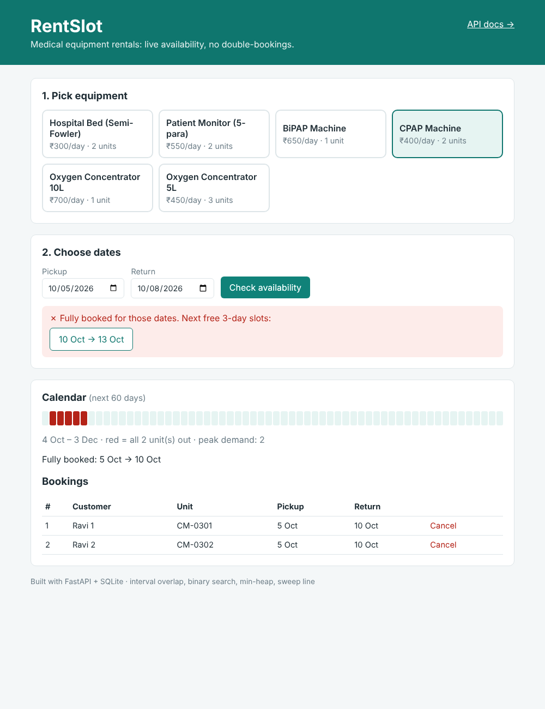

# RentSlot: Equipment Rental Availability System


**Live demo:** https://rentslot.onrender.com · [API docs](https://rentslot.onrender.com/docs) (free tier, first load can take ~30s)

A booking backend for medical equipment rentals (oxygen concentrators, CPAP/BiPAP, patient monitors, hospital beds) that **never double-books a unit**. You give it a date range and it tells you if anything is free. If nothing is, it **suggests the next free slots** across every unit in stock.

I built it after doing freelance work on a medical equipment rental website ([Kinvara Health](https://kmaan0786akwork-collab.github.io/Kinvara-health/)). That site shows products, but a real rental business has to answer *"is it free from the 12th to the 20th?"*, and that's an interval problem.



**Stack:** Python · FastAPI · SQLite · vanilla JS · pytest · GitHub Actions

---

## Features

- Check availability for any equipment and date range
- Book a unit. The system picks *which* physical unit (best-fit, see below)
- If something's sold out, get the **k earliest alternative slots** with the same rental length
- Calendar view: which dates are fully booked, and peak demand
- Cancel bookings to free the slot right away
- Double-booking is blocked in **two layers**: application logic + a SQLite trigger
- Race-safe: `BEGIN IMMEDIATE` makes check-then-insert atomic
- Interactive API docs at `/docs` (Swagger)

## DSA used

All algorithms are in [`app/intervals.py`](app/intervals.py). It's pure Python with no DB code, and fully unit-tested.

Bookings are **half-open intervals `[start, end)`**: `end` is the return date, so a unit can go out again the same day it comes back.

| Problem | Technique | Complexity |
|---|---|---|
| Do two bookings clash? | Overlap test `a.start < b.end && b.start < a.end` | O(1) |
| Is this unit free for `[s, e)`? | **Binary search** (`bisect`) on the unit's sorted bookings. Only one neighbour can overlap | O(log n) |
| Free windows on one unit | Linear scan of gaps between sorted bookings | O(n) |
| Next k free slots across all units | **Min-heap k-way merge** of every unit's gap stream | O((U + k) log U) |
| Peak concurrent rentals | **Min-heap of end dates** (the "Meeting Rooms II" pattern) | O(n log n) |
| Dates when every unit is out | **Sweep line** over +1/−1 events | O(n log n) |
| Merge busy ranges | Sort + merge intervals | O(n log n) |

**Why binary search works:** one unit's bookings never overlap, so sorting by start also sorts them by end. The only booking that could clash with `[s, e)` is the last one that starts before `e`. Check that one and you're done.

**Why a heap for suggestions:** each unit gives a sorted stream of free windows. Merging U sorted streams to get the earliest k is exactly the "merge k sorted lists" problem.

**Best-fit unit assignment:** when several units are free, the booking goes on the unit whose last rental ended closest to the new start date. That packs bookings tightly and keeps other units open for long rentals.

## Database

```
equipment (id, name, category, daily_rate)
    │ 1..n
units     (id, equipment_id → equipment, serial_no, is_active)
    │ 1..n
bookings  (id, unit_id → units, customer_name, customer_phone,
           start_date, end_date, status, created_at)
```

- Partial index on `bookings(unit_id, start_date, end_date) WHERE status='confirmed'`
- `CHECK (end_date > start_date)`
- `prevent_double_booking` trigger rejects any overlapping confirmed booking at the DB level

Full schema: [`app/schema.sql`](app/schema.sql)

## API

| Method | Endpoint | Description |
|---|---|---|
| GET | `/api/equipment` | Equipment types with unit counts |
| GET | `/api/availability?equipment_id=1&start=2026-11-01&end=2026-11-05` | Free units + cost, or suggestions if sold out |
| POST | `/api/bookings` | Create a booking (`409` + suggestions if no unit is free) |
| GET | `/api/bookings?equipment_id=1` | List bookings |
| GET | `/api/bookings/{id}` | One booking |
| DELETE | `/api/bookings/{id}` | Cancel |
| GET | `/api/equipment/{id}/calendar?days=60` | Fully booked ranges + peak demand |

Example of a sold-out response (`409`):

```json
{
  "detail": "No unit is free for those dates",
  "suggestions": [
    {"start": "2026-11-04", "end": "2026-11-07"},
    {"start": "2026-11-09", "end": "2026-11-12"}
  ]
}
```

## Run locally

```bash
git clone https://github.com/kmaan0786akwork-collab/rentslot.git
cd rentslot
python -m venv .venv
# Windows: .venv\Scripts\activate    macOS/Linux: source .venv/bin/activate
pip install -r requirements-dev.txt
uvicorn app.main:app --reload
```

Open http://127.0.0.1:8000 for the UI, or http://127.0.0.1:8000/docs for the API. The database is created and seeded with sample inventory on first run.

## Tests

```bash
pytest -v
```

26 tests cover the interval algorithms (edge cases like back-to-back bookings and containment) and the API (sell-out → suggestions, cancellation, validation, and the DB trigger). They run on every push via GitHub Actions.

## Deploy (free)

The repo includes `render.yaml`. On [Render](https://render.com), choose **New → Blueprint**, then pick this repo. Note: the free tier's disk resets on redeploy, so the demo data reseeds.

## Project structure

```
app/
  intervals.py   # DSA: overlap, binary search, heap, sweep line
  service.py     # business logic (SQL + algorithms)
  main.py        # FastAPI routes + validation
  db.py          # connection, schema init, seed data
  schema.sql     # tables, indexes, anti-double-booking trigger
static/          # frontend (HTML/CSS/JS)
tests/           # pytest
```

## License

MIT
